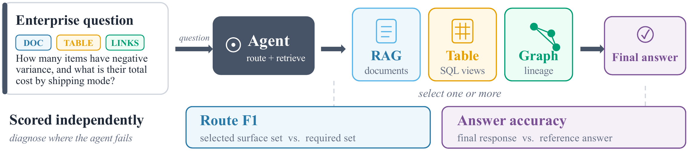
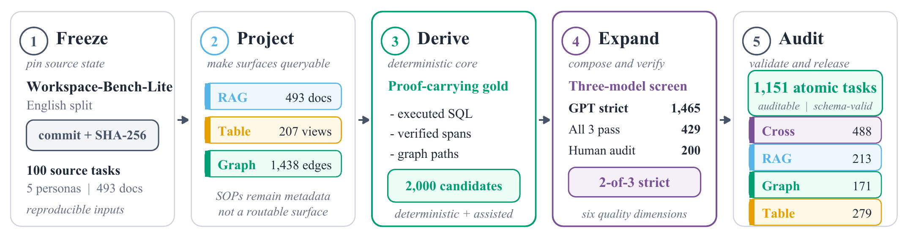
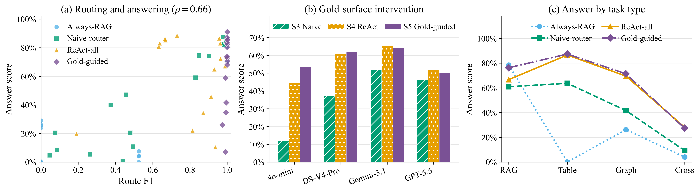
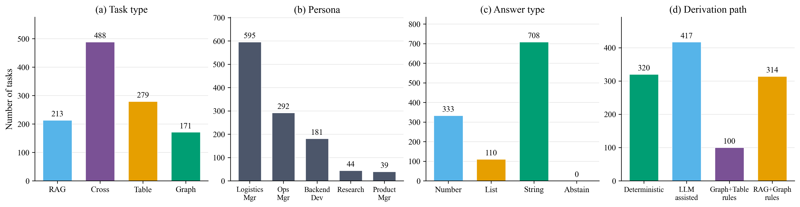

# WorkSurface-Bench

**Benchmarking enterprise agents on multi-surface knowledge routing.**

WorkSurface-Bench evaluates whether an agent can select and combine the right
enterprise knowledge surfaces—document retrieval (RAG), structured tables, and
dependency graphs—before measuring evidence acquisition and answer correctness.

- **Dataset:** 1,151 atomic tasks from 100 Workspace-Bench-Lite source tasks
- **Surfaces:** RAG, Table, Graph, and cross-surface combinations
- **Evaluation:** Route, Evidence, Answer, Efficiency, and Aggregate scores
- **Experiments:** 4 backbones × 6 agent settings = 27,624 released trajectories
- **Human audit:** 3 annotators on a stratified 200-task sample

The complete data release and official trajectories are distributed separately
with the anonymous submission.



An agent first decides which knowledge surfaces are required, then acquires
evidence and produces an answer. WorkSurface-Bench evaluates these stages
separately, making routing failures distinguishable from evidence-acquisition
and answer-synthesis failures.

## Repository structure

```text
worksurface/   Surface construction, task derivation, quality control
scoring/       Route, Evidence, Answer, Efficiency, and Safety scorers
runner/        Tool environment and S1–S6 agent harness
results/       Analysis and release-construction scripts (generated files ignored)
scripts/       Source download, provenance lock, budgets, HF release builder
schemas/       JSON Schema for benchmark tasks
assets/        Figures used in this README
docs/          Public data-provenance documentation
```

Downloaded source workspaces, canonical surfaces, model trajectories, audit
workbooks, and generated outputs are intentionally not stored in Git. They are
available from the accompanying anonymous data release or can be regenerated by
the pipeline.

## Installation

Python 3.10 or newer is required.

```bash
cd WorkSurface-Bench
python -m venv .venv
source .venv/bin/activate
pip install -e ".[dev]"
```

For API-backed construction or evaluation, copy `.env.example` to a local
`.env` or export the variables in your shell. Never commit real credentials.

```bash
export WSB_API_BASE="https://your-provider.example/v1"
export WSB_API_KEY="..."
```

The clients use an OpenAI-compatible chat-completions interface. Model IDs are
passed through unchanged to the configured provider.

## Benchmark construction



Workspace files are converted into canonical document, table, and dependency-
graph surfaces. Candidate tasks are derived with explicit gold evidence and
surface requirements, then pass deterministic validation, multi-model
screening, and human evaluation before release. The final benchmark contains
1,151 tasks selected for answerability, correctness, naturalness, and genuine
surface necessity rather than for uniform quotas.

## Get the benchmark data

The accompanying anonymous data package contains the task JSONL,
viewer-friendly Parquet files, canonical workspace surfaces, human-audit votes,
scored reports, and raw trajectories. Unpack it as `hf_release/` beside this
README.

```python
from datasets import load_dataset

tasks = load_dataset(
    "parquet", data_files="hf_release/data/tasks.parquet", split="train"
)
scores = load_dataset(
    "parquet", data_files="hf_release/results/trajectory_scores.parquet", split="train"
)
audit = load_dataset(
    "parquet", data_files="hf_release/audits/human_audit_majority.parquet", split="train"
)
```

The runner expects the canonical resource root. For example:

```bash
python -m runner.run_bench \
  --setting S4 \
  --model mock \
  --tasks hf_release/data/tasks.jsonl \
  --data-root hf_release/resources \
  --out runs/S4_mock.jsonl \
  --score
```

`mock` is a deterministic wiring fixture, not a reported baseline. It checks
the tools → trace → scorer path without an API key.

## Agent settings

| ID | Setting | Purpose |
| --- | --- | --- |
| S1 | Closed book | No knowledge-surface tools |
| S2 | Always RAG | Document retrieval only |
| S3 | Single-surface router | Select one surface before answering |
| S4 | ReAct all-tools | Explore RAG, Table, and Graph tools |
| S5 | Gold-constrained | Gold labels with only the required tools exposed |
| S6 | Gold-hint/all | Gold labels while all tools remain exposed |

S6 isolates the effect of supplying surface information; S6→S5 isolates the
additional effect of removing irrelevant tools. Tool execution, evidence
acquisition, and answer synthesis remain model-controlled in both conditions.

## Results at a glance



Routing quality and answer accuracy are positively related but not equivalent.
Gold-surface guidance produces near-ceiling routing for several backbones, yet
answer gains remain smaller because the model must still retrieve the right
evidence, execute the required operations, and synthesize the final response.



The released distribution reflects the availability of verifiable operations
in the source workspaces. Cross-surface tasks are the largest group, while
three-surface tasks remain intentionally limited because all three surfaces
must be independently necessary for the answer.

## Scoring

Each task is scored separately for routing, evidence, answer correctness, and
efficiency. The main aggregate is:

```text
Aggregate = 0.35 Answer
          + 0.30 Evidence
          + 0.25 Route F1
          + 0.10 Efficiency
```

Score an existing trace file:

```bash
python -m scoring.score_run \
  --tasks hf_release/data/tasks.jsonl \
  --traces runs/S4_model.jsonl \
  --out runs/S4_model.scored.json
```

Build the main result tables from scored runs:

```bash
python -m runner.make_tables --runs runs --out runs/tables
```

## Rebuild the canonical surfaces

The upstream English Workspace-Bench-Lite source is frozen by
`data/wsb_lock.json`.

```bash
python scripts/download_wsb_lite_en.py --tier full
python scripts/build_lock_and_metadata.py
python -m worksurface.convert_profiles
python -m worksurface.derive_tasks
python -m worksurface.qc_v2
```

LLM-assisted augmentation and screening scripts require `WSB_API_BASE` and
`WSB_API_KEY`. See [PIPELINE.md](PIPELINE.md) for the complete construction and
evaluation flow.

## Tests

```bash
pytest
python -m scoring.test_scoring
python -m runner.test_react
```

## Data provenance

WorkSurface-Bench projects the English Workspace-Bench-Lite release onto
canonical document, table, and graph surfaces. Workspace-Bench uses a hybrid
construction process: task scenarios and dependency annotations are human
curated, while workspace files combine public resources with grounded generated
artifacts. The 1,151 tasks are atomic derivatives of 100 source tasks, not
1,151 independent workspaces.

See [the provenance note](docs/wsb_data_provenance.md) and
[Workspace-Bench 1.0](https://arxiv.org/abs/2605.03596).

## License

Code in this repository is released under the [Apache License 2.0](LICENSE).
Derived benchmark data are released under CC BY 4.0, subject to applicable
Workspace-Bench-Lite attribution and licensing requirements.
